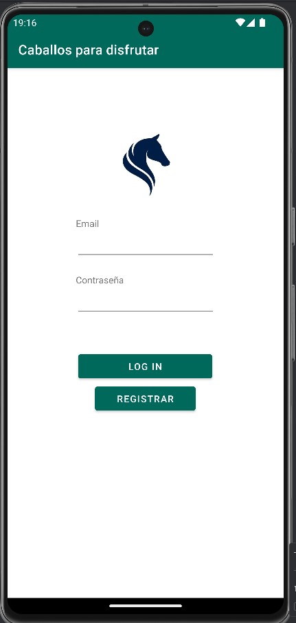
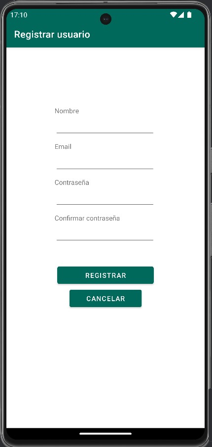
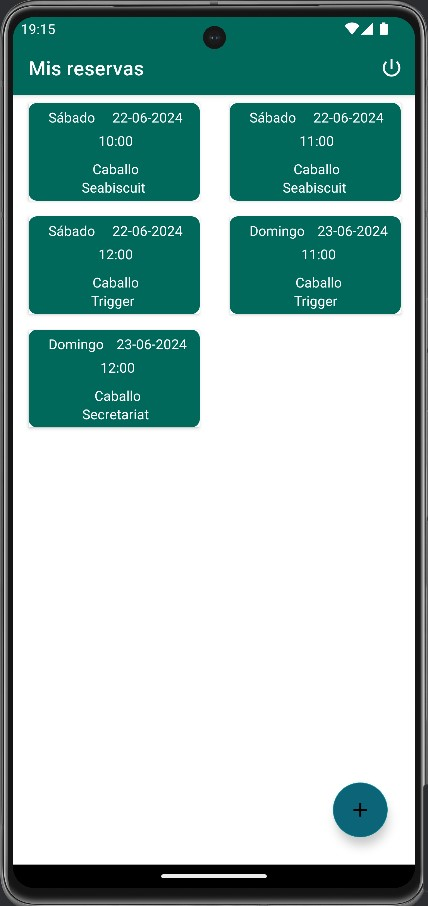
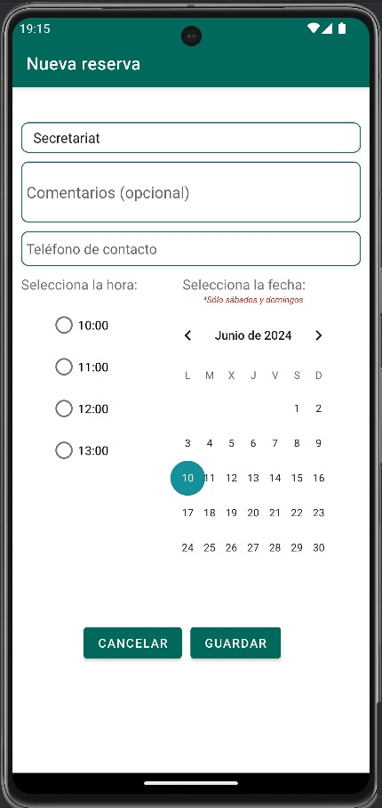
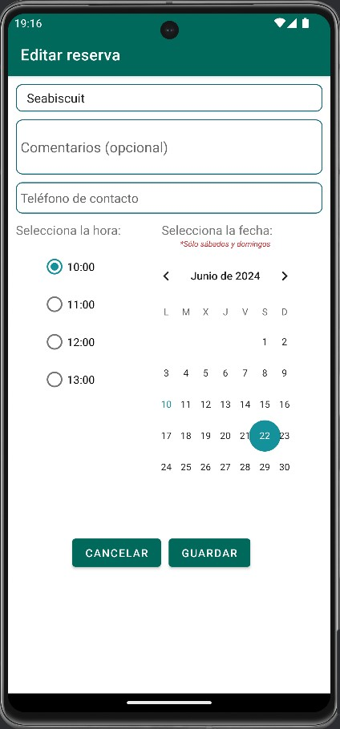

APLICACIÓN MÓVIL RESERVAS

La aplicación móvil para la comunicación con el API creado en nuestra aplicación con laravel estará estructurada en los paquetes Adapter, Model, Retrofit y UI. En el paquete UI se encuentran las activities de nuestra interfaz. Estas se corresponden con el login (MainActivity), el registro de usuario (RegisterActivity), las reservas del usuario (MisReservas), añadir una reserva (AddReserva) y editar una reserva (EditReserva). Como apunte, he añadido que desde la actividad MisReservas no se puede hacer retroceso hacia atrás, ya que es necesario hacer el logout.

El paquete Adapter contiene las clases necesarias para el funcionamiento del RecyclerView con la lista de reservas como se ha realizado en anteriores tareas. El paquete Model contiene las clases necesarias para manejar los datos de las reservas, los caballos y el usuario.

El paquete retrofit contiene las clases necesarias para la comunicación con el API creado. En ella nos encontramos la interfaz ApiService, que contendrá las funciones para realizar las peticiones, y la clase RetrofitClient mediante la cual crearemos la instancia para poder comunicarnos con el API. También tenemos dentro de este paquete dos más, request y response. El paquete request contiene las clases que se usarán para realizar la petición al API, mientras que el paquete response contendrá las clases que se usarán para tratar los datos obtenidos mediante la respuesta por parte del API.

La interfaz de usuario es bastante sencilla. Tras hacer el login o el registro, accederemos a la vista de las reservas actuales, las cuales se mostrarán mediante un RecyclerView a modo de tarjetas. Pulsando sobre ellas podremos acceder al formulario de edición de la reserva, el cual tendrá una serie de verificaciones previas al envío de la petición y, en caso de estar los datos correctos y realizar la petición, mostrará mensajes de error que son controlados mediante la clase ApiController de nuestra aplicación laravel. En la vista de las reservas, tenemos también un botón flotante para poder añadir las reservas. Este nos mostrará la vista del formulario para añadir los datos de una nueva reserva, al igual que al editar. Para borrar las reservas, se ha establecido un deslizamiento a la izquierda de los item de la lista, que serán borrados tras aceptar un mensaje de aviso. Por último, en la toolbar de esta vista tenemos un icono para realizar el logout, que nos llevará de vuelta a la ventana del login.

Cuando se realiza o se modifica una reserva se envía un mensaje por whatsapp. Este mensaje se realizará al número de teléfono introducido por el usuario a la hora de realizar la reserva, pero este teléfono no se guarda en la base de datos, así que cada vez que hagamos logout deberemos volver a introducirlo para realizar reservas (mientras esté la sesión iniciada se guardará el teléfono para no tener que introducirlo constantemente).

CAPTURAS

- Login

- Registro

- Mis reservas

- Añadir reserva

- Editar reserva

